W3-PM1 & W3-PM2 | CYBERSECURITY | NETWORKWALKS ACADEMY
# Week 3 – Cracking a Password Protected PDF (John the Ripper + Networkwalks Tools)

## What this lab was about

For Week 3 of my Networkwalks Cybersecurity training, the task was to take a password protected PDF, pull a crackable hash out of it, and recover the original password using a dictionary attack. I did this two different ways, on two separate copies of the sample file: once the "traditional" way with **John the Ripper** through its **Johnny GUI**, and once using **Networkwalks' own browser based hash calculator and cracker**. Both routes got me to a working password and both unlocked a copy of the PDF, so I've documented each path separately below since the tools, the file copy, and the steps weren't identical.

This was carried out entirely inside a controlled training lab environment on files that were provided for this exercise. Nothing here should be pointed at a file, account, or system you don't have explicit permission to test.

## Goals for the exercise

- Understand what a "password hash" actually is when we're talking about an encrypted PDF, and why you can't just read the password straight out of the file
- Extract that hash using two different extraction tools and compare the results
- Run an actual dictionary attack against the hash rather than just reading about how one works
- Confirm the recovered password actually opens the file (not just that the tool says "cracked")
- Get comfortable with John the Ripper's GUI front end (Johnny), since most command-line tools have a steeper learning curve
- Write the whole workflow up in a way I could hand to someone else and have them reproduce it

## Kit used

| Tool | What I used it for |
|---|---|
| OnlineHashCrack – PDF Hash Extractor | Converting the locked PDF into a pdf2john style hash |
| Johnny (GUI for John the Ripper) | Loading the hash and running the dictionary attack locally |
| John the Ripper 1.9.0-jumbo-1 | The actual cracking engine behind Johnny |
| Networkwalks Hash Calculator | A second, browser based way to pull the same kind of hash straight from the PDF |
| Networkwalks Password Cracker | An in-browser dictionary attack tool that mimics how John the Ripper works |
| Notepad / Text Editor | Holding the raw hash text before saving it as a file Johnny could open |
| Adobe Acrobat Reader | Viewing and unlocking the recovered PDFs |

---

## Route 1: John the Ripper via Johnny

### Step 1 – Pulling the hash out of the PDF

The PDF itself doesn't store the password in plain text anywhere, so before John the Ripper (or anything else) can attempt to guess it, you need something in a format the cracking tool understands. I used the online **PDF Hash Extractor** tool for this: uploaded the locked PDF, and it ran `pdf2john` behind the scenes to spit out a hash string starting with `$pdf$4*4*128*-1060*1*16*...`.

Once it finished processing, the tool returned the full hash in a text box on the page.

.png)

### Step 2 – Getting the hash somewhere Johnny could read it

Johnny expects a file it can open, so I pasted the copied hash into a text file and saved it as `hash1.txt`, then dropped that into the working folder for this task.

### Step 3 – Pointing Johnny at the John the Ripper executable

Before Johnny can run anything, it needs to know where the actual `john.exe` binary lives on disk. Under Settings I set the path to the jumbo build I'd downloaded, and Johnny confirmed it had detected John the Ripper 1.9.0-jumbo-1.

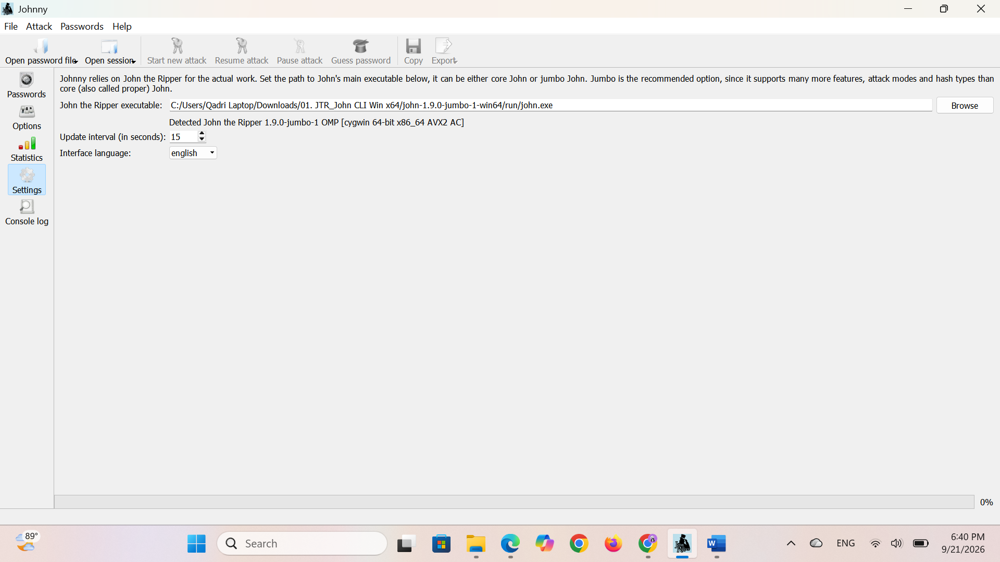

### Step 4 – Loading the hash and kicking off the attack

From there it was a case of opening the saved hash file through Johnny's "Open password file" option, confirming it picked up the hash correctly, and starting a new attack session.

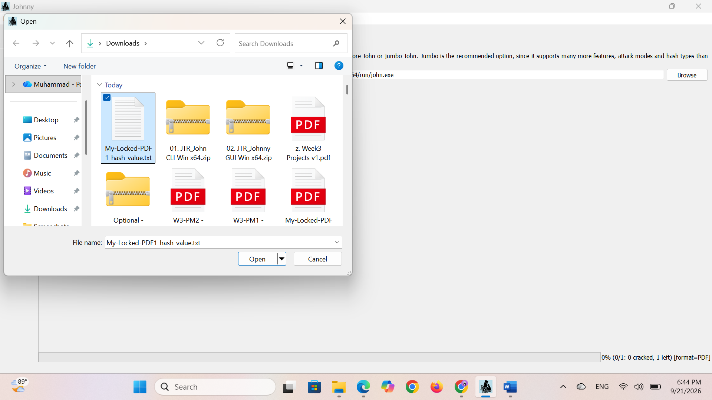

### Step 5 – Result

It didn't take long for Johnny to come back with a match: **password1**.

### Step 6 – Confirming it actually works

A cracked password on screen doesn't mean much until you've actually used it, so I opened the copy of the PDF and typed in the recovered password. The file unlocked straight away, confirming the crack was genuine.

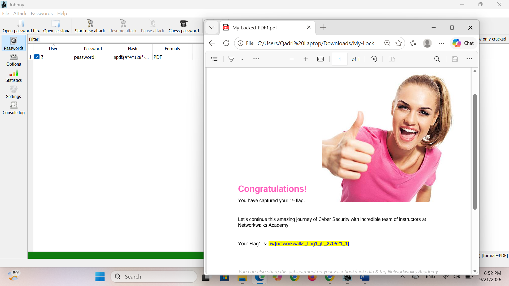

#### I repeated the same Johnny workflow against two further sample hashes to confirm the method held up consistently:
#### pdf2
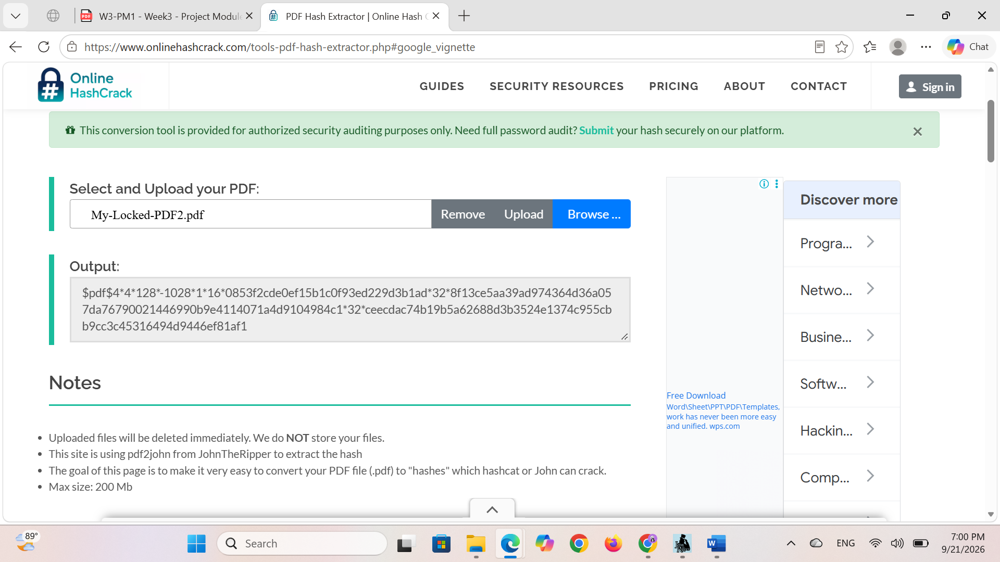

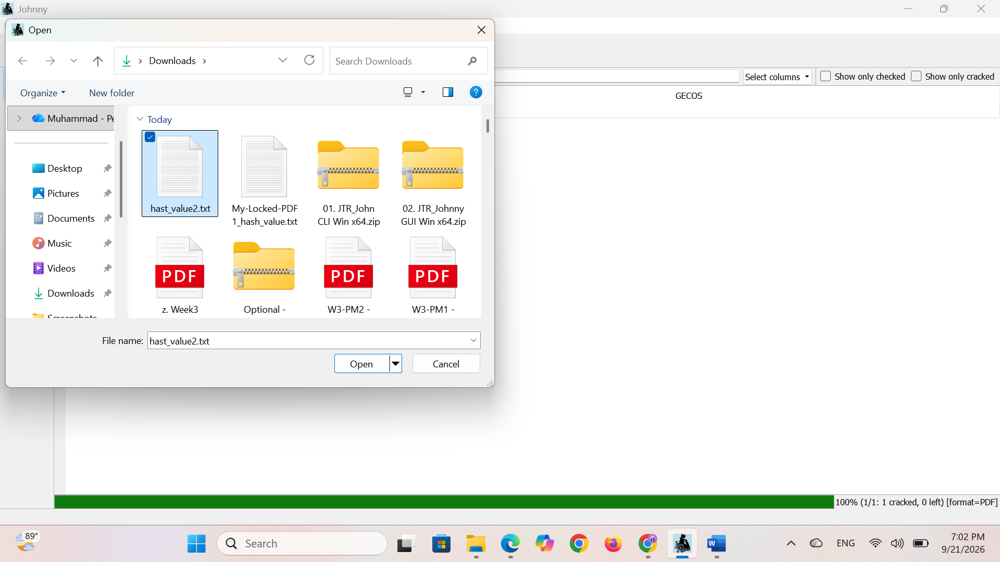

#### pdf3

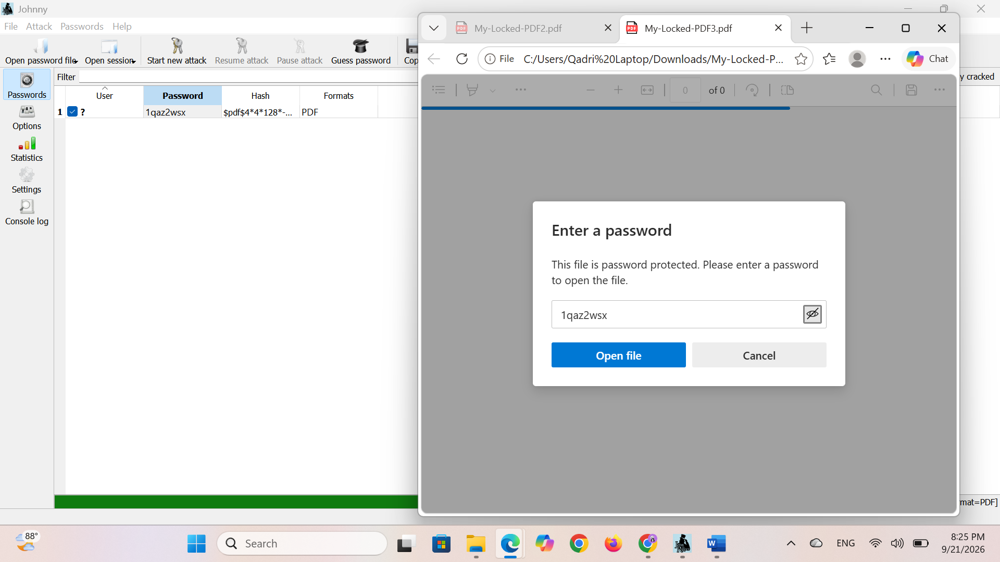
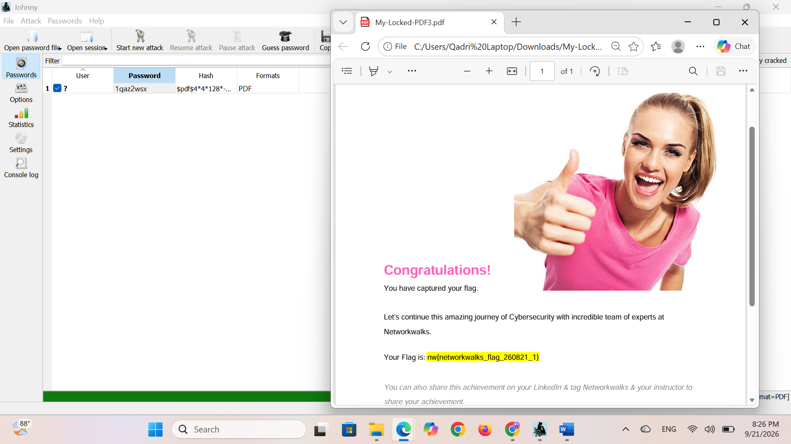

---

## Route 2: Networkwalks' own browser based tools

Wanting to see how this same process looks without installing anything, I repeated the exercise using **Networkwalks' own lab tools**, which walk through the same idea (hash extraction, then a dictionary attack) but entirely inside the browser. This time I worked from fresh, separate copies of the sample file downloaded straight from the lab page, so the hashes and passwords recovered here are independent of Route 1's results.

### Step 1 – Extracting the hash with the Hash Calculator

The Hash Calculator tool has a dedicated PDF tab that reads the file locally in the browser (nothing gets uploaded to a server) and pulls out the same style of `$pdf$` hash that pdf2john produces.

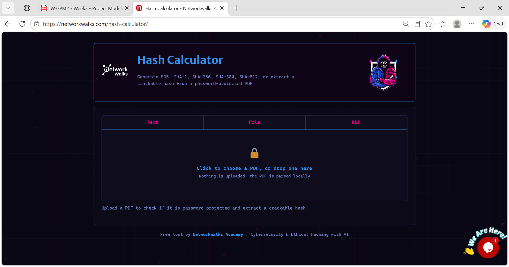

I uploaded the first sample PDF and the tool confirmed it was encrypted, handing back the hash along with useful metadata (revision, version, key length).

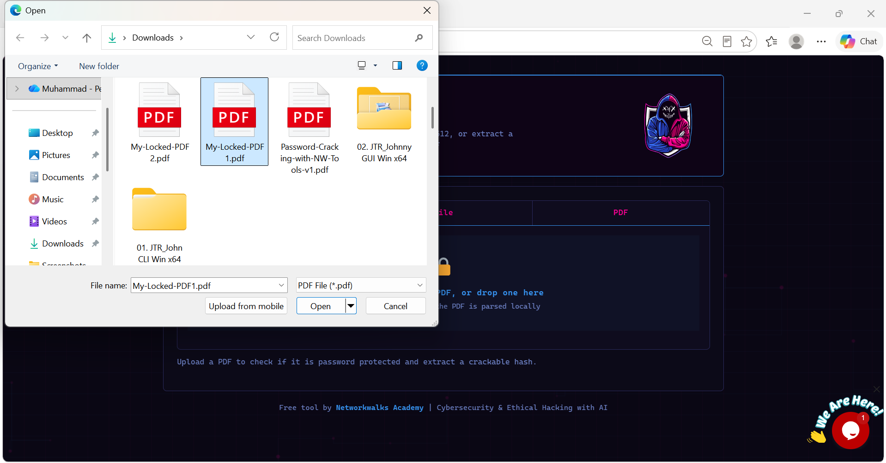

### Step 2 – Feeding the hash into the Password Cracker

The Password Cracker page is built around the same logic John the Ripper uses: hash every candidate word from a list and compare it against the target hash until something matches. I pasted the hash from the calculator straight into the input box.

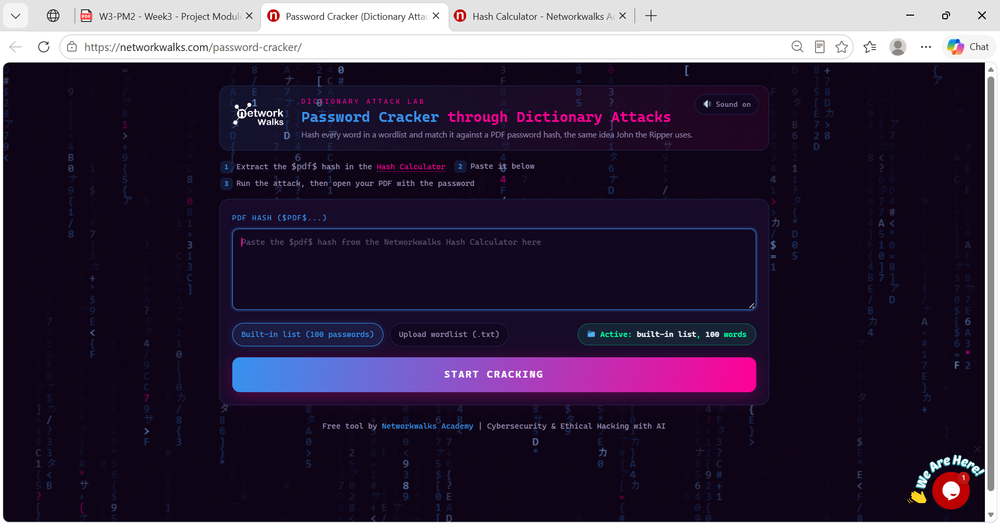

### Step 3 – Watching the attack run

Once I hit start, the tool worked through the built-in wordlist in real time, testing each candidate against the hash until it landed on a match.

### Step 4 – Unlocking the file

Same as before, the real test was opening the PDF with the recovered password to make sure it wasn't a false positive. It opened without issue.

### Repeating the process for PDF2 and PDF3

To confirm the method was consistent and not a one-off, I ran the exact same extraction-and-crack workflow against two more sample files.

**PDF2:**

.png)

**PDF3:**

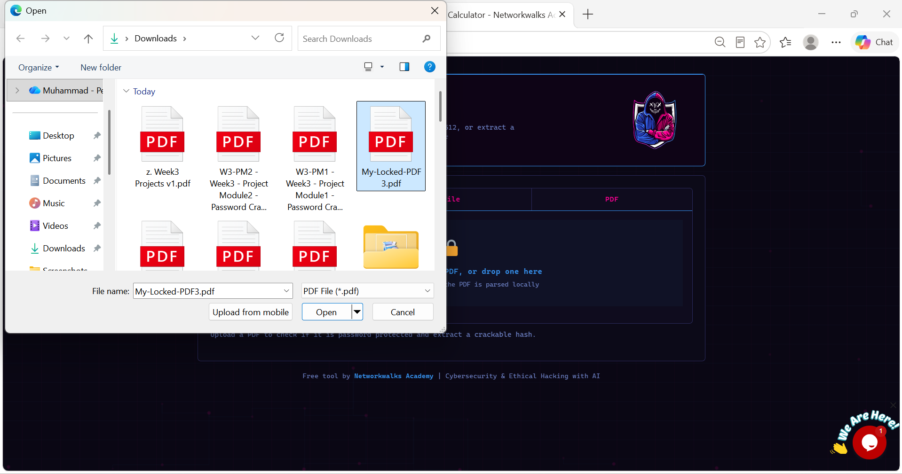

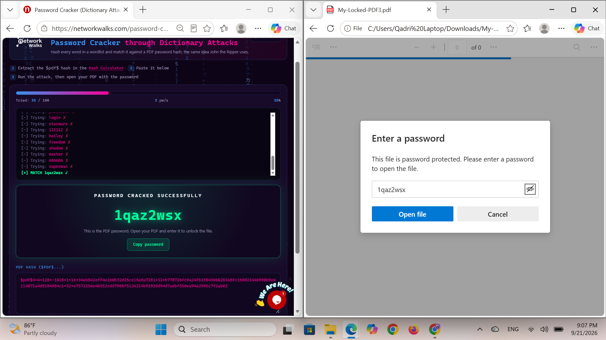
.png)

---

## What actually stuck with me

Running through this twice — once with a proper offline tool and once entirely in a browser — made a few things click that I don't think I'd have picked up just reading about password cracking:

- A "hash" isn't the password scrambled up, it's a one-way fingerprint. The only way to "reverse" it is to keep guessing inputs and hashing them until something produces a matching fingerprint. That's the entire idea behind a dictionary attack.
- The recovered passwords cracked almost instantly because they're exactly the kind of thing that shows up near the top of any common password list. Neither tool had to work hard.
- The extraction step matters just as much as the cracking step. If the hash isn't pulled out correctly (wrong format, missing salt, wrong revision), the cracking tool has nothing useful to work with, regardless of how good your wordlist is.
- Doing the same task with a GUI tool like Johnny versus a purpose-built web app made it obvious that the underlying mechanics don't change, just how much of the process is hidden from you. Johnny still expects you to configure the John the Ripper binary path and manage the attack session yourself; the web tool handles all of that for you.

## Why this matters from a defensive angle

Every password in this lab fell in seconds using nothing more than a small dictionary. That's the whole point of the exercise: it's a very direct demonstration of why short, common, or predictable passwords offer almost no real protection once someone has the hash. A few practical takeaways worth carrying forward:

- Avoid anything that would appear on a top-100 or top-1000 password list — "password1" is a textbook example
- Length and unpredictability matter far more than complexity rules like forcing a symbol or a capital letter
- Where possible, protected files and accounts should also be backed by a second factor of authentication, so that even a cracked password isn't enough on its own
- If you're responsible for distributing sensitive documents, consider that PDF encryption alone is not a strong control against a motivated attacker with the right tools

## Training details

- **Program:** Networkwalks Cybersecurity & Ethical Hacking Training
- **Week:** 3
- **Modules:** Project Module 1 (Password Cracking with JTR) & Project Module 2 (Password Cracking with Networkwalks Tools)
- **Task:** Password recovery from an encrypted PDF using John the Ripper / Johnny and Networkwalks' Hash Calculator / Password Cracker
- **Focus area:** Applied cybersecurity / ethical hacking fundamentals

## A note on ethics

Everything in this write-up was carried out against sample files supplied specifically for the training task, inside a lab environment set up for that purpose. Password cracking techniques like the ones shown here should only ever be used against systems, files, or accounts you own or have explicit written permission to test. Using them against anything else is illegal in most jurisdictions and not something this repository is meant to encourage.

---

## 👤 Author

**Muhammad Talha**
Cybersecurity Trainee | NetworkWalks Academy
🔗 LinkedIn: [[LinkedIn](https://www.linkedin.com/in/talha2715/)]

**Project Information:** Program: Cybersecurity & Ethical Hacking at NetworkWalks | Week: 03
